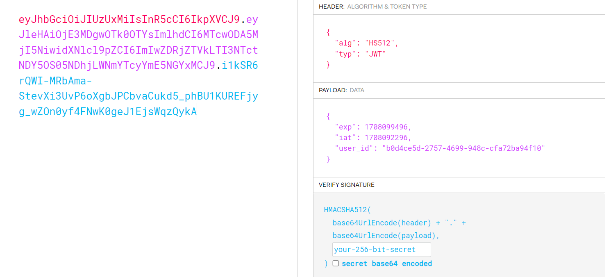

# Auth_Service
### Сервис аутентификации

## Запуск

Запуск контейнеров postgres и самого приложения `docker compose --env-file ./config/.env up -d`

Для комфортной работы со всеми методами API можно воспользоваться 
моей [коллекцией запросов в Postman](https://www.postman.com/joint-operations-operator-99149269/workspace/authservice/collection/28284200-141e2b15-966b-4db8-8af7-85e786b70c3d?action=share&creator=28284200)

### При отсутствии возможности использовать Postman

1. Генерация токенов ` curl --location 'http://localhost:8091/auth?id=b0d4ce5d-2757-4699-948c-cfa72ba94f10'`
2. Генерация токенов по Refresh-токену `curl --location 'http://localhost:8091/refresh?token=c93152736f95acde00f2bad31fbf01' --header 'id: b0d4ce5d-2757-4699-948c-cfa72ba94f10'`

## Описание сервиса
Данный сервис генерирует 2 JWT токена по полученному GUID пользователя.\
Генерируется Access и Refresh токены. Каждый имеет своё время жизни
- Access - 2 часа
- Refresh - 1 неделя

В случае с Access время жизни формируется в самом токене, и актуальность токена
проверяется самой программой. 
В случае с Refresh токеном - он добавляется в MongoDB в зашифрованном виде, при этом сам документ в базе данных
имеет заданное выше время жизни с помощью TTL индекса. 

Access токен хранит в себе время создания, время жизни токена, GUID пользователя, а также иная информация.

Refresh токен - это хеш-код, созданный на базе GUID пользователя с некоторыми дополнениями. Каждый раз генерируется новый токен.

**Для удобства проверки ТЗ я добавил [.env файл](./config/.env) в репозиторий. Но в реальном проекте я бы этого бы не сделал, так как этот файл хранит важную информацию**

### Контейнеризация в Docker
Для запуска всего сервера в контейнерах был описан [Dockerfile](Dockerfile) для описания образа в Docker.
С помощью [docker-compose](docker-compose.yml) файла был описан основной ряд контейнеров, которые нужно запустить.  

## Используемые технологии
- Golang 1.21
- MongoDB
- Docker
- Postman
- [Viper](https://github.com/spf13/viper)
- [Gorilla/mux](https://github.com/gorilla/mux)
- [MongoDB Golang Driver](https://www.mongodb.com/docs/drivers/go/current/)

